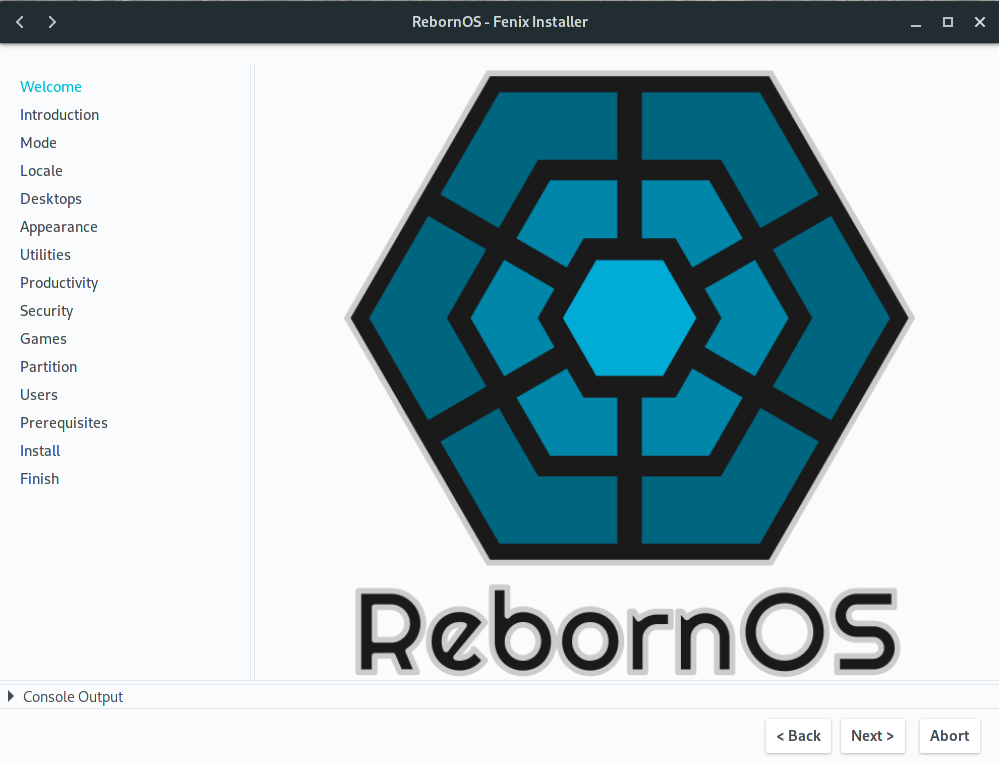
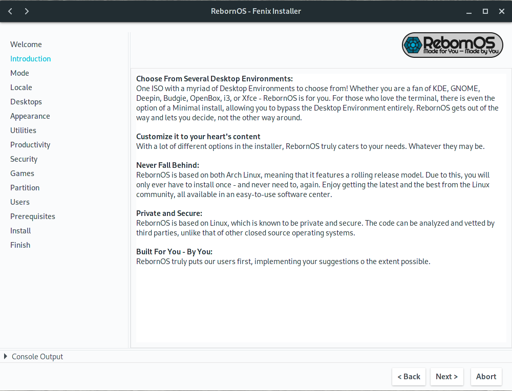
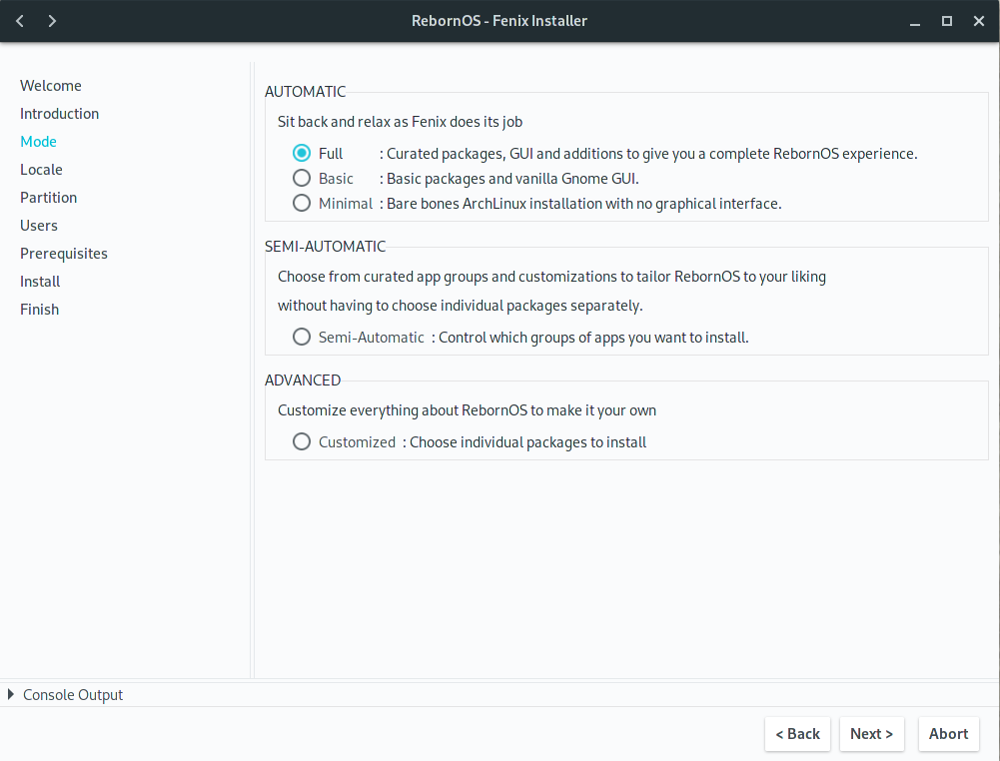
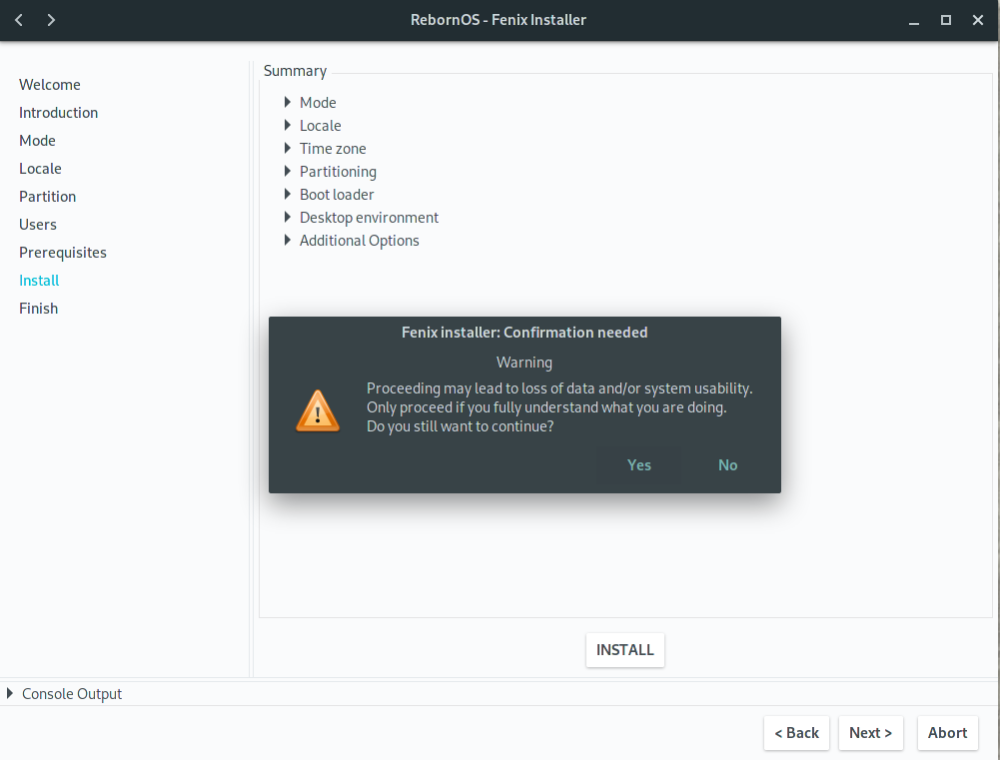
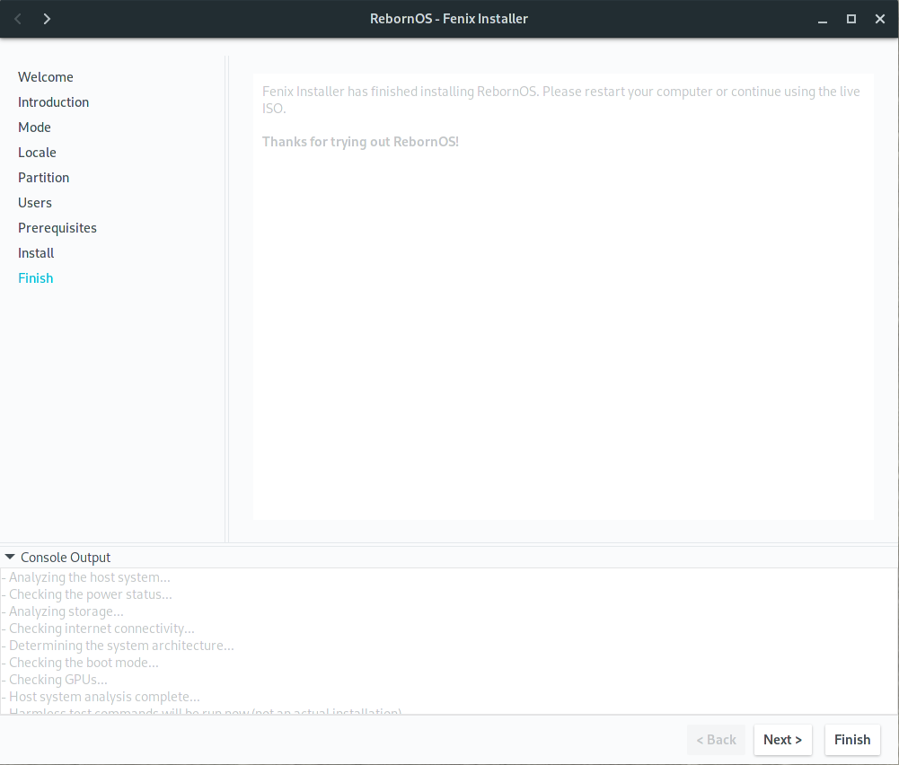
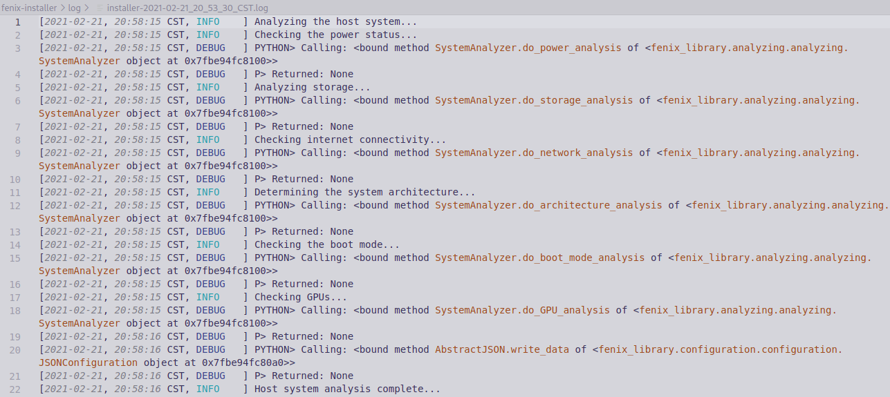

# RebornOS Welcome

*Documentation by @shivanandvp (shivanandvp@rebornos.org, shivanand.pattanshetti@gmail.com)*  

*Artwork by @Trivoxel*

*Please refer to [`LICENSE`](./LICENSE) for license information.*

## Overview

RebornOS Welcome is the application that would display on the RebornOS ISO and on first use of RebornOS after installation. 
It contains basic links to help get started on RebornOS as a new user. Some useful resources that are linked include

- The website
- Download page
- Support platforms
  - Discord
  - Forum
  - Facebook
  - Twitter
- RebornOS Wiki
- Arch Wiki
- Donation links
- Contribution links

## [PLEASE CLICK HERE](https://rebornos-team.gitlab.io/applications/rebornos-welcome/index.html) for the full documentation
  
<!-- 

 -->
